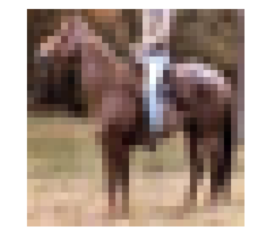
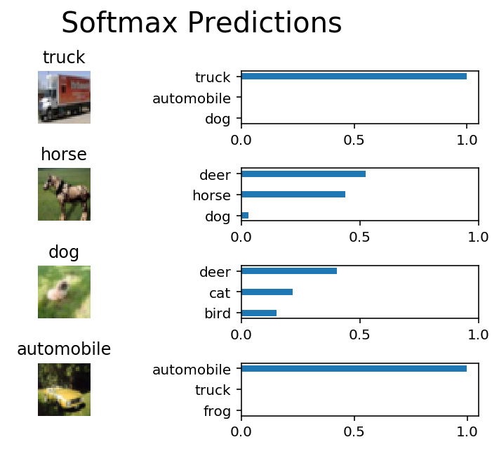

# cnn-image-classification-tensorflow-CIFAR-10
Implementation Convolution Neural Network using tensorflow for CIFAR-10 dataselt

# Image Classification
In this project, you'll classify images from the [CIFAR-10 dataset](https://www.cs.toronto.edu/~kriz/cifar.html).  The dataset consists of airplanes, dogs, cats, and other objects. You'll preprocess the images, then train a convolutional neural network on all the samples. The images need to be normalized and the labels need to be one-hot encoded.  You'll get to apply what you learned and build a convolutional, max pooling, dropout, and fully connected layers.  At the end, you'll get to see your neural network's predictions on the sample images.
## Get the Data
Run the following cell to download the [CIFAR-10 dataset for python](https://www.cs.toronto.edu/~kriz/cifar-10-python.tar.gz).


```python
"""
DON'T MODIFY ANYTHING IN THIS CELL THAT IS BELOW THIS LINE
"""
from urllib.request import urlretrieve
from os.path import isfile, isdir
from tqdm import tqdm
import problem_unittests as tests
import tarfile

cifar10_dataset_folder_path = 'cifar-10-batches-py'

# Use Floyd's cifar-10 dataset if present
floyd_cifar10_location = '/input/cifar-10/python.tar.gz'
if isfile(floyd_cifar10_location):
    tar_gz_path = floyd_cifar10_location
else:
    tar_gz_path = 'cifar-10-python.tar.gz'

class DLProgress(tqdm):
    last_block = 0

    def hook(self, block_num=1, block_size=1, total_size=None):
        self.total = total_size
        self.update((block_num - self.last_block) * block_size)
        self.last_block = block_num

if not isfile(tar_gz_path):
    with DLProgress(unit='B', unit_scale=True, miniters=1, desc='CIFAR-10 Dataset') as pbar:
        urlretrieve(
            'https://www.cs.toronto.edu/~kriz/cifar-10-python.tar.gz',
            tar_gz_path,
            pbar.hook)

if not isdir(cifar10_dataset_folder_path):
    with tarfile.open(tar_gz_path) as tar:
        tar.extractall()
        tar.close()


tests.test_folder_path(cifar10_dataset_folder_path)
```

    CIFAR-10 Dataset: 171MB [00:45, 3.78MB/s]                               
    

    All files found!
    

## Explore the Data
The dataset is broken into batches to prevent your machine from running out of memory.  The CIFAR-10 dataset consists of 5 batches, named `data_batch_1`, `data_batch_2`, etc.. Each batch contains the labels and images that are one of the following:
* airplane
* automobile
* bird
* cat
* deer
* dog
* frog
* horse
* ship
* truck

Understanding a dataset is part of making predictions on the data.  Play around with the code cell below by changing the `batch_id` and `sample_id`. The `batch_id` is the id for a batch (1-5). The `sample_id` is the id for a image and label pair in the batch.

Ask yourself "What are all possible labels?", "What is the range of values for the image data?", "Are the labels in order or random?".  Answers to questions like these will help you preprocess the data and end up with better predictions.


```python
%matplotlib inline
%config InlineBackend.figure_format = 'retina'

import helper
import numpy as np

# Explore the dataset
batch_id = 5
sample_id = 5000
helper.display_stats(cifar10_dataset_folder_path, batch_id, sample_id)
```

    
    Stats of batch 5:
    Samples: 10000
    Label Counts: {0: 1014, 1: 1014, 2: 952, 3: 1016, 4: 997, 5: 1025, 6: 980, 7: 977, 8: 1003, 9: 1022}
    First 20 Labels: [1, 8, 5, 1, 5, 7, 4, 3, 8, 2, 7, 2, 0, 1, 5, 9, 6, 2, 0, 8]
    
    Example of Image 5000:
    Image - Min Value: 0 Max Value: 255
    Image - Shape: (32, 32, 3)
    Label - Label Id: 7 Name: horse
    





## Implement Preprocess Functions
### Normalize
In the cell below, implement the `normalize` function to take in image data, `x`, and return it as a normalized Numpy array. The values should be in the range of 0 to 1, inclusive.  The return object should be the same shape as `x`.


```python
def normalize(x):
    """
    Normalize a list of sample image data in the range of 0 to 1
    : x: List of image data.  The image shape is (32, 32, 3)
    : return: Numpy array of normalize data
    """
    # TODO: Implement Function
    #x = np.divide(x,np.max(x, axis=0))
    return x/np.max(x, axis=0)


"""
DON'T MODIFY ANYTHING IN THIS CELL THAT IS BELOW THIS LINE
"""
tests.test_normalize(normalize)
```

    test
    [[[[ 52 222  90]
       [127 127 143]
       [150 214 159]
       ..., 
       [ 10 139  56]
       [ 82 110 144]
       [250  88   0]]
    
      [[226  45  56]
       [239  93 212]
       [212 138 216]
       ..., 
       [ 73  92 175]
       [234 145  30]
       [ 44  86  96]]
    
      [[109 205 251]
       [  0 139  91]
       [  1 210  30]
       ..., 
       [ 34 194 252]
       [173 178  97]
       [144 158 202]]
    
      ..., 
      [[238  66  35]
       [ 34 170  38]
       [120 132 150]
       ..., 
       [168 225 209]
       [ 74 117 145]
       [ 10  78 148]]
    
      [[ 54  78  37]
       [108 112 231]
       [142 155 189]
       ..., 
       [176 236 138]
       [167 209  73]
       [106  63 178]]
    
      [[ 24 203 204]
       [116 164  47]
       [ 23  55  16]
       ..., 
       [200 182  53]
       [180  85  50]
       [167 134  41]]]
    
    
     [[[161  36 189]
       [ 94 248 228]
       [ 57 170  67]
       ..., 
       [233  91  29]
       [103 243 216]
       [160  70  81]]
    
      [[118  88 250]
       [247  92  26]
       [ 73 113 136]
       ..., 
       [159  80 191]
       [ 10 147  47]
       [172 125  18]]
    
      [[177 195 174]
       [ 14   1 170]
       [192  48 123]
       ..., 
       [ 87  23 221]
       [ 76  97 238]
       [163  50 209]]
    
      ..., 
      [[167 235 191]
       [193  15 247]
       [ 19 222 230]
       ..., 
       [ 87 143 177]
       [ 86  77  11]
       [154 128 115]]
    
      [[254 186  58]
       [141 221 250]
       [ 76 181 236]
       ..., 
       [211 158  10]
       [221   8 162]
       [  2 181 235]]
    
      [[149 206 219]
       [106 196 170]
       [229  11 161]
       ..., 
       [237  97 126]
       [ 78 173  79]
       [234 189 125]]]
    
    
     [[[ 40 104  46]
       [138 142 128]
       [232 162 211]
       ..., 
       [ 88 180  60]
       [ 91  49  28]
       [212 126  48]]
    
      [[158  95 173]
       [ 78  29 200]
       [181 190  20]
       ..., 
       [221  25 149]
       [115 163 113]
       [220 215 100]]
    
      [[183 137 235]
       [173 138 189]
       [185  80 168]
       ..., 
       [211 108  86]
       [187  84 214]
       [167 177  12]]
    
      ..., 
      [[240 224 198]
       [121  44 146]
       [ 97 189 168]
       ..., 
       [242 221  30]
       [135 204 240]
       [ 58 252  98]]
    
      [[ 37  79 112]
       [103 224 227]
       [192 199  86]
       ..., 
       [ 41 119 106]
       [ 85 245 143]
       [223 230 143]]
    
      [[225 218  26]
       [  0 196  78]
       [ 49 105 243]
       ..., 
       [201 250  41]
       [ 18 138 137]
       [128 118 131]]]
    
    
     ..., 
     [[[184  74 181]
       [122 121 178]
       [ 36 207  69]
       ..., 
       [ 10 247  93]
       [ 92   3  72]
       [194  85   8]]
    
      [[165  66 185]
       [  1  98 176]
       [  4 183 143]
       ..., 
       [126 171 235]
       [228  95 192]
       [250 204 246]]
    
      [[105 216 164]
       [130 154  72]
       [ 46  11  96]
       ..., 
       [ 49 224  55]
       [226 189 238]
       [ 54  14 212]]
    
      ..., 
      [[ 79 201  19]
       [111 211  47]
       [186 214 149]
       ..., 
       [110 236  11]
       [216 168   3]
       [167 172 149]]
    
      [[176 243 184]
       [145  15  98]
       [ 57  65 234]
       ..., 
       [ 94 169  90]
       [ 80  83 111]
       [ 53   5 172]]
    
      [[242  60 114]
       [101  86 148]
       [ 75 134 241]
       ..., 
       [117 234 195]
       [121 139 112]
       [166 181 152]]]
    
    
     [[[146  45 149]
       [134 108  91]
       [248 236 187]
       ..., 
       [ 94  47 247]
       [178 254  47]
       [ 84 123  89]]
    
      [[255  51 153]
       [181 210  93]
       [150 101 247]
       ..., 
       [130  99  63]
       [240  58 116]
       [253 197 108]]
    
      [[ 69 254 126]
       [ 73 191  54]
       [183  87  36]
       ..., 
       [ 24 241 177]
       [ 26 169 139]
       [143 227 110]]
    
      ..., 
      [[ 96  82 186]
       [100 223  18]
       [124 155 113]
       ..., 
       [152 191 135]
       [109  15  43]
       [206 233 178]]
    
      [[ 33 133 213]
       [184  52 180]
       [234 234 250]
       ..., 
       [129  31  61]
       [156  10  99]
       [172 113  69]]
    
      [[224 188  85]
       [177  84 108]
       [ 16 187 235]
       ..., 
       [121 205 148]
       [145 227  80]
       [206 218 158]]]
    
    
     [[[ 38  64 132]
       [158  98 147]
       [ 79 222  26]
       ..., 
       [168 246   0]
       [ 70  16 128]
       [ 49   5 112]]
    
      [[134 120   6]
       [ 24 190   3]
       [ 94 247  24]
       ..., 
       [234  71  38]
       [248  26 134]
       [208  83  98]]
    
      [[ 12  84 201]
       [188 227  12]
       [ 43 146  78]
       ..., 
       [186 203 224]
       [ 57 240   3]
       [208 186 239]]
    
      ..., 
      [[ 50  75 152]
       [177  88 140]
       [254 219 179]
       ..., 
       [ 12 158  93]
       [ 12 164 153]
       [184 102  23]]
    
      [[197  35 188]
       [253  58  47]
       [237  26  96]
       ..., 
       [239 172 241]
       [135   3 136]
       [137  29  30]]
    
      [[176 140 247]
       [164  53  38]
       [ 91 153 253]
       ..., 
       [ 35  85  33]
       [138  98 217]
       [190 254  16]]]]
    Tests Passed
    

### One-hot encode
Just like the previous code cell, you'll be implementing a function for preprocessing.  This time, you'll implement the `one_hot_encode` function. The input, `x`, are a list of labels.  Implement the function to return the list of labels as One-Hot encoded Numpy array.  The possible values for labels are 0 to 9. The one-hot encoding function should return the same encoding for each value between each call to `one_hot_encode`.  Make sure to save the map of encodings outside the function.

Hint: Don't reinvent the wheel.


```python
from sklearn.preprocessing import OneHotEncoder
```


```python
def one_hot_encode(x):
    """
    One hot encode a list of sample labels. Return a one-hot encoded vector for each label.
    : x: List of sample Labels
    : return: Numpy array of one-hot encoded labels
    """
    # TODO: Implement Function
    oneHot = np.zeros((len(x), 10))
    for idx, v in enumerate(x):
        oneHot[idx][v] = 1
    return oneHot


"""
DON'T MODIFY ANYTHING IN THIS CELL THAT IS BELOW THIS LINE
"""
tests.test_one_hot_encode(one_hot_encode)
```

    Tests Passed
    

### Randomize Data
As you saw from exploring the data above, the order of the samples are randomized.  It doesn't hurt to randomize it again, but you don't need to for this dataset.

## Preprocess all the data and save it
Running the code cell below will preprocess all the CIFAR-10 data and save it to file. The code below also uses 10% of the training data for validation.


```python
"""
DON'T MODIFY ANYTHING IN THIS CELL
"""
# Preprocess Training, Validation, and Testing Data
helper.preprocess_and_save_data(cifar10_dataset_folder_path, normalize, one_hot_encode)
```

# Check Point
This is your first checkpoint.  If you ever decide to come back to this notebook or have to restart the notebook, you can start from here.  The preprocessed data has been saved to disk.


```python
"""
DON'T MODIFY ANYTHING IN THIS CELL
"""
import pickle
import problem_unittests as tests
import helper

# Load the Preprocessed Validation data
valid_features, valid_labels = pickle.load(open('preprocess_validation.p', mode='rb'))
```

## Build the network
For the neural network, you'll build each layer into a function.  Most of the code you've seen has been outside of functions. To test your code more thoroughly, we require that you put each layer in a function.  This allows us to give you better feedback and test for simple mistakes using our unittests before you submit your project.

>**Note:** If you're finding it hard to dedicate enough time for this course each week, we've provided a small shortcut to this part of the project. In the next couple of problems, you'll have the option to use classes from the [TensorFlow Layers](https://www.tensorflow.org/api_docs/python/tf/layers) or [TensorFlow Layers (contrib)](https://www.tensorflow.org/api_guides/python/contrib.layers) packages to build each layer, except the layers you build in the "Convolutional and Max Pooling Layer" section.  TF Layers is similar to Keras's and TFLearn's abstraction to layers, so it's easy to pickup.

>However, if you would like to get the most out of this course, try to solve all the problems _without_ using anything from the TF Layers packages. You **can** still use classes from other packages that happen to have the same name as ones you find in TF Layers! For example, instead of using the TF Layers version of the `conv2d` class, [tf.layers.conv2d](https://www.tensorflow.org/api_docs/python/tf/layers/conv2d), you would want to use the TF Neural Network version of `conv2d`, [tf.nn.conv2d](https://www.tensorflow.org/api_docs/python/tf/nn/conv2d). 

Let's begin!

### Input
The neural network needs to read the image data, one-hot encoded labels, and dropout keep probability. Implement the following functions
* Implement `neural_net_image_input`
 * Return a [TF Placeholder](https://www.tensorflow.org/api_docs/python/tf/placeholder)
 * Set the shape using `image_shape` with batch size set to `None`.
 * Name the TensorFlow placeholder "x" using the TensorFlow `name` parameter in the [TF Placeholder](https://www.tensorflow.org/api_docs/python/tf/placeholder).
* Implement `neural_net_label_input`
 * Return a [TF Placeholder](https://www.tensorflow.org/api_docs/python/tf/placeholder)
 * Set the shape using `n_classes` with batch size set to `None`.
 * Name the TensorFlow placeholder "y" using the TensorFlow `name` parameter in the [TF Placeholder](https://www.tensorflow.org/api_docs/python/tf/placeholder).
* Implement `neural_net_keep_prob_input`
 * Return a [TF Placeholder](https://www.tensorflow.org/api_docs/python/tf/placeholder) for dropout keep probability.
 * Name the TensorFlow placeholder "keep_prob" using the TensorFlow `name` parameter in the [TF Placeholder](https://www.tensorflow.org/api_docs/python/tf/placeholder).

These names will be used at the end of the project to load your saved model.

Note: `None` for shapes in TensorFlow allow for a dynamic size.


```python
import tensorflow as tf
```


```python

def neural_net_image_input(image_shape):
    """
    Return a Tensor for a batch of image input
    : image_shape: Shape of the images
    : return: Tensor for image input.
    """
    # TODO: Implement Function
    print(image_shape)
    return tf.placeholder(tf.float32, shape=[None, image_shape[0], image_shape[1], image_shape[2]], name='x')


def neural_net_label_input(n_classes):
    """
    Return a Tensor for a batch of label input
    : n_classes: Number of classes
    : return: Tensor for label input.
    """
    # TODO: Implement Function
    return tf.placeholder(tf.float32, shape=[None, n_classes], name='y')


def neural_net_keep_prob_input():
    """
    Return a Tensor for keep probability
    : return: Tensor for keep probability.
    """
    # TODO: Implement Function
    return tf.placeholder(tf.float32, name='keep_prob')


"""
DON'T MODIFY ANYTHING IN THIS CELL THAT IS BELOW THIS LINE
"""
tf.reset_default_graph()
tests.test_nn_image_inputs(neural_net_image_input)
tests.test_nn_label_inputs(neural_net_label_input)
tests.test_nn_keep_prob_inputs(neural_net_keep_prob_input)
```

    (32, 32, 3)
    Image Input Tests Passed.
    Label Input Tests Passed.
    Keep Prob Tests Passed.
    

### Convolution and Max Pooling Layer
Convolution layers have a lot of success with images. For this code cell, you should implement the function `conv2d_maxpool` to apply convolution then max pooling:
* Create the weight and bias using `conv_ksize`, `conv_num_outputs` and the shape of `x_tensor`.
* Apply a convolution to `x_tensor` using weight and `conv_strides`.
 * We recommend you use same padding, but you're welcome to use any padding.
* Add bias
* Add a nonlinear activation to the convolution.
* Apply Max Pooling using `pool_ksize` and `pool_strides`.
 * We recommend you use same padding, but you're welcome to use any padding.

**Note:** You **can't** use [TensorFlow Layers](https://www.tensorflow.org/api_docs/python/tf/layers) or [TensorFlow Layers (contrib)](https://www.tensorflow.org/api_guides/python/contrib.layers) for **this** layer, but you can still use TensorFlow's [Neural Network](https://www.tensorflow.org/api_docs/python/tf/nn) package. You may still use the shortcut option for all the **other** layers.


```python
def conv2d_maxpool(x_tensor, conv_num_outputs, conv_ksize, conv_strides, pool_ksize, pool_strides):
    """
    Apply convolution then max pooling to x_tensor
    :param x_tensor: TensorFlow Tensor
    :param conv_num_outputs: Number of outputs for the convolutional layer
    :param conv_ksize: kernal size 2-D Tuple for the convolutional layer
    :param conv_strides: Stride 2-D Tuple for convolution
    :param pool_ksize: kernal size 2-D Tuple for pool
    :param pool_strides: Stride 2-D Tuple for pool
    : return: A tensor that represents convolution and max pooling of x_tensor
    """
    # TODO: Implement Function
    #shape = [filter_size, filter_size, num_input_channels, num_filters]
    
    num_input_channels = x_tensor.shape.as_list()[3]
    num_filters = conv_num_outputs
    print("x_tensor shape: {} conv_num_outpus: {} conv_ksize: {}\
            conv_strides: {} pool_ksize: {} pool_strides: {}".format(x_tensor.shape, conv_num_outputs,
                                                                      conv_ksize, conv_strides, pool_ksize, pool_strides)) 
    
    shape = [conv_ksize[0], conv_ksize[1], num_input_channels, num_filters]
    print("shape: ",shape)
    weight = tf.Variable(tf.truncated_normal(shape, mean=0, stddev=0.08))
    bias = tf.Variable(tf.constant(0.05, shape=[num_filters]))
    #bias = tf.Variable(tf.zeros(num_filters))
    conv = tf.nn.conv2d(x_tensor, weight, strides=[1,conv_strides[0], conv_strides[1],1], padding='SAME')
    conv = tf.nn.bias_add(conv, bias)
    conv = tf.nn.relu(conv)
    return tf.nn.max_pool(conv, ksize=[1,pool_ksize[0],pool_ksize[1],1], 
                  strides=[1,pool_strides[0], pool_strides[1], 1],
                  padding='SAME')


"""
DON'T MODIFY ANYTHING IN THIS CELL THAT IS BELOW THIS LINE
"""
tests.test_con_pool(conv2d_maxpool)
```

    x_tensor shape: (?, 32, 32, 5) conv_num_outpus: 10 conv_ksize: (2, 2)            conv_strides: (4, 4) pool_ksize: (2, 2) pool_strides: (2, 2)
    shape:  [2, 2, 5, 10]
    Tests Passed
    

### Flatten Layer
Implement the `flatten` function to change the dimension of `x_tensor` from a 4-D tensor to a 2-D tensor.  The output should be the shape (*Batch Size*, *Flattened Image Size*). Shortcut option: you can use classes from the [TensorFlow Layers](https://www.tensorflow.org/api_docs/python/tf/layers) or [TensorFlow Layers (contrib)](https://www.tensorflow.org/api_guides/python/contrib.layers) packages for this layer. For more of a challenge, only use other TensorFlow packages.


```python
def flatten(x_tensor):
    """
    Flatten x_tensor to (Batch Size, Flattened Image Size)
    : x_tensor: A tensor of size (Batch Size, ...), where ... are the image dimensions.
    : return: A tensor of size (Batch Size, Flattened Image Size).
    """
    # TODO: Implement Function
    #print(x_tensor)
    shape = x_tensor.get_shape()
    num_features = shape[1:4].num_elements()
    layer_flat = tf.reshape(x_tensor, [-1, num_features])
    print("shape: {} num_feautres: {}".format(shape, layer_flat.get_shape().as_list()[1]))
    return layer_flat


"""
DON'T MODIFY ANYTHING IN THIS CELL THAT IS BELOW THIS LINE
"""
tests.test_flatten(flatten)
```

    shape: (?, 10, 30, 6) num_feautres: 1800
    Tests Passed
    

### Fully-Connected Layer
Implement the `fully_conn` function to apply a fully connected layer to `x_tensor` with the shape (*Batch Size*, *num_outputs*). Shortcut option: you can use classes from the [TensorFlow Layers](https://www.tensorflow.org/api_docs/python/tf/layers) or [TensorFlow Layers (contrib)](https://www.tensorflow.org/api_guides/python/contrib.layers) packages for this layer. For more of a challenge, only use other TensorFlow packages.


```python
def fully_conn(x_tensor, num_outputs):
    """
    Apply a fully connected layer to x_tensor using weight and bias
    : x_tensor: A 2-D tensor where the first dimension is batch size.
    : num_outputs: The number of output that the new tensor should be.
    : return: A 2-D tensor where the second dimension is num_outputs.
    """
    # TODO: Implement Function
    print(x_tensor.get_shape())
    weights = tf.Variable(tf.truncated_normal([x_tensor.get_shape().as_list()[1], num_outputs], mean=0.0, stddev=0.08))
    bias = tf.Variable(tf.constant(0.05, shape=[num_outputs]))
    #bias = tf.Variable(tf.zeros(num_outputs))
    tf.Variable(tf.zeros(num_outputs))
    fc = tf.matmul(x_tensor, weights) + bias
    return tf.nn.relu(fc)


"""
DON'T MODIFY ANYTHING IN THIS CELL THAT IS BELOW THIS LINE
"""
tests.test_fully_conn(fully_conn)
```

    (?, 128)
    Tests Passed
    

### Output Layer
Implement the `output` function to apply a fully connected layer to `x_tensor` with the shape (*Batch Size*, *num_outputs*). Shortcut option: you can use classes from the [TensorFlow Layers](https://www.tensorflow.org/api_docs/python/tf/layers) or [TensorFlow Layers (contrib)](https://www.tensorflow.org/api_guides/python/contrib.layers) packages for this layer. For more of a challenge, only use other TensorFlow packages.

**Note:** Activation, softmax, or cross entropy should **not** be applied to this.


```python
def output(x_tensor, num_outputs):
    """
    Apply a output layer to x_tensor using weight and bias
    : x_tensor: A 2-D tensor where the first dimension is batch size.
    : num_outputs: The number of output that the new tensor should be.
    : return: A 2-D tensor where the second dimension is num_outputs.
    """
    # TODO: Implement Function
    weights = tf.Variable(tf.truncated_normal([x_tensor.get_shape().as_list()[1], num_outputs],mean=0.0,stddev=0.5))
    bias = tf.Variable(tf.constant(0.05, shape=[num_outputs]))
    #bias = tf.Variable(tf.zeros(num_outputs))
    out = tf.add(tf.matmul(x_tensor, weights),bias)
    return out


"""
DON'T MODIFY ANYTHING IN THIS CELL THAT IS BELOW THIS LINE
"""
tests.test_output(output)
```

    Tests Passed
    

### Create Convolutional Model
Implement the function `conv_net` to create a convolutional neural network model. The function takes in a batch of images, `x`, and outputs logits.  Use the layers you created above to create this model:

* Apply 1, 2, or 3 Convolution and Max Pool layers
* Apply a Flatten Layer
* Apply 1, 2, or 3 Fully Connected Layers
* Apply an Output Layer
* Return the output
* Apply [TensorFlow's Dropout](https://www.tensorflow.org/api_docs/python/tf/nn/dropout) to one or more layers in the model using `keep_prob`. 


```python
def conv_net(x, keep_prob):
    """
    Create a convolutional neural network model
    : x: Placeholder tensor that holds image data.
    : keep_prob: Placeholder tensor that hold dropout keep probability.
    : return: Tensor that represents logits
    """
    
    # TODO: Apply 1, 2, or 3 Convolution and Max Pool layers
    #    Play around with different number of outputs, kernel size and stride
    # Function Definition from Above:
    #    conv2d_maxpool(x_tensor, conv_num_outputs, conv_ksize, conv_strides, pool_ksize, pool_strides)
    conv1 = conv2d_maxpool(x, 128, [5,5], [2,2], [3,3], [2,2])
    conv1 = tf.nn.dropout(conv1, keep_prob)
    conv2 = conv2d_maxpool(conv1, 256, [3,3], [1,1], [1,1], [2,2])
    #conv2 = tf.nn.dropout(conv2, keep_prob)
    #conv3 = conv2d_maxpool(conv2, 128, [5,5], [2,2], [3,3], [2,2])
    # TODO: Apply a Flatten Layer
    # Function Definition from Above:
    #   flatten(x_tensor)
    fl1=flatten(conv2)
    print("fl1: ",fl1," : ",fl1.get_shape().as_list()[1])
    # TODO: Apply 1, 2, or 3 Fully Connected Layers
    #    Play around with different number of outputs
    # Function Definition from Above:
    #   fully_conn(x_tensor, num_outputs)
    fc1 = fully_conn(fl1,500)
    fc1 = tf.nn.dropout(fc1, keep_prob)
    fc2 = fully_conn(fc1,100)
    #tf.nn.dropout(fc1, keep_prob)
    # TODO: Apply an Output Layer
    #    Set this to the number of classes
    # Function Definition from Above:
    #   output(x_tensor, num_outputs)
    out = output(fc2,10)
    return out


"""
DON'T MODIFY ANYTHING IN THIS CELL THAT IS BELOW THIS LINE
"""

##############################
## Build the Neural Network ##
##############################

# Remove previous weights, bias, inputs, etc..
tf.reset_default_graph()

# Inputs
x = neural_net_image_input((32, 32, 3))
y = neural_net_label_input(10)
keep_prob = neural_net_keep_prob_input()

# Model
logits = conv_net(x, keep_prob)

# Name logits Tensor, so that is can be loaded from disk after training
logits = tf.identity(logits, name='logits')

# Loss and Optimizer
cost = tf.reduce_mean(tf.nn.softmax_cross_entropy_with_logits(logits=logits, labels=y))
optimizer = tf.train.AdamOptimizer().minimize(cost)

# Accuracy
correct_pred = tf.equal(tf.argmax(logits, 1), tf.argmax(y, 1))
accuracy = tf.reduce_mean(tf.cast(correct_pred, tf.float32), name='accuracy')

tests.test_conv_net(conv_net)
```

    (32, 32, 3)
    x_tensor shape: (?, 32, 32, 3) conv_num_outpus: 128 conv_ksize: [5, 5]            conv_strides: [2, 2] pool_ksize: [3, 3] pool_strides: [2, 2]
    shape:  [5, 5, 3, 128]
    x_tensor shape: (?, 8, 8, 128) conv_num_outpus: 256 conv_ksize: [3, 3]            conv_strides: [1, 1] pool_ksize: [1, 1] pool_strides: [2, 2]
    shape:  [3, 3, 128, 256]
    shape: (?, 4, 4, 256) num_feautres: 4096
    fl1:  Tensor("Reshape:0", shape=(?, 4096), dtype=float32)  :  4096
    (?, 4096)
    (?, 500)
    x_tensor shape: (?, 32, 32, 3) conv_num_outpus: 128 conv_ksize: [5, 5]            conv_strides: [2, 2] pool_ksize: [3, 3] pool_strides: [2, 2]
    shape:  [5, 5, 3, 128]
    x_tensor shape: (?, 8, 8, 128) conv_num_outpus: 256 conv_ksize: [3, 3]            conv_strides: [1, 1] pool_ksize: [1, 1] pool_strides: [2, 2]
    shape:  [3, 3, 128, 256]
    shape: (?, 4, 4, 256) num_feautres: 4096
    fl1:  Tensor("Reshape_4:0", shape=(?, 4096), dtype=float32)  :  4096
    (?, 4096)
    (?, 500)
    Neural Network Built!
    

## Train the Neural Network
### Single Optimization
Implement the function `train_neural_network` to do a single optimization.  The optimization should use `optimizer` to optimize in `session` with a `feed_dict` of the following:
* `x` for image input
* `y` for labels
* `keep_prob` for keep probability for dropout

This function will be called for each batch, so `tf.global_variables_initializer()` has already been called.

Note: Nothing needs to be returned. This function is only optimizing the neural network.


```python
def train_neural_network(session, optimizer, keep_probability, feature_batch, label_batch):
    """
    Optimize the session on a batch of images and labels
    : session: Current TensorFlow session
    : optimizer: TensorFlow optimizer function
    : keep_probability: keep probability
    : feature_batch: Batch of Numpy image data
    : label_batch: Batch of Numpy label data
    """
    # TODO: Implement Function
    session.run(optimizer, feed_dict={
        x: feature_batch,
        y : label_batch,
        keep_prob : keep_probability
    })


"""
DON'T MODIFY ANYTHING IN THIS CELL THAT IS BELOW THIS LINE
"""
tests.test_train_nn(train_neural_network)
```

    Tests Passed
    

### Show Stats
Implement the function `print_stats` to print loss and validation accuracy.  Use the global variables `valid_features` and `valid_labels` to calculate validation accuracy.  Use a keep probability of `1.0` to calculate the loss and validation accuracy.


```python
def print_stats(session, feature_batch, label_batch, cost, accuracy):
    """
    Print information about loss and validation accuracy
    : session: Current TensorFlow session
    : feature_batch: Batch of Numpy image data
    : label_batch: Batch of Numpy label data
    : cost: TensorFlow cost function
    : accuracy: TensorFlow accuracy function
    """
    # TODO: Implement Function
    loss = session.run(cost, feed_dict={
        x : feature_batch,
        y : label_batch,
        keep_prob: 1.0
    })
    validation_accuracy = sess.run(accuracy, feed_dict={
        x: valid_features,
        y: valid_labels,
        keep_prob: 1.0
    })
    print('Loss: {:>10.4f} Accuracy: {:.6f}'.format(loss,validation_accuracy))
    
```

### Hyperparameters
Tune the following parameters:
* Set `epochs` to the number of iterations until the network stops learning or start overfitting
* Set `batch_size` to the highest number that your machine has memory for.  Most people set them to common sizes of memory:
 * 64
 * 128
 * 256
 * ...
* Set `keep_probability` to the probability of keeping a node using dropout


```python
# TODO: Tune Parameters
epochs = 75
batch_size = 256
keep_probability = 0.5
```

### Train on a Single CIFAR-10 Batch
Instead of training the neural network on all the CIFAR-10 batches of data, let's use a single batch. This should save time while you iterate on the model to get a better accuracy.  Once the final validation accuracy is 50% or greater, run the model on all the data in the next section.


```python
"""
DON'T MODIFY ANYTHING IN THIS CELL
"""
print('Checking the Training on a Single Batch...')
with tf.Session() as sess:
    # Initializing the variables
    sess.run(tf.global_variables_initializer())
    
    # Training cycle
    for epoch in range(epochs):
        batch_i = 1
        for batch_features, batch_labels in helper.load_preprocess_training_batch(batch_i, batch_size):
            train_neural_network(sess, optimizer, keep_probability, batch_features, batch_labels)
        print('Epoch {:>2}, CIFAR-10 Batch {}:  '.format(epoch + 1, batch_i), end='')
        print_stats(sess, batch_features, batch_labels, cost, accuracy)
```

    Checking the Training on a Single Batch...
    Epoch  1, CIFAR-10 Batch 1:  Loss:     2.2879 Accuracy: 0.126000
    Epoch  2, CIFAR-10 Batch 1:  Loss:     2.1939 Accuracy: 0.235000
    Epoch  3, CIFAR-10 Batch 1:  Loss:     2.0788 Accuracy: 0.299000
    Epoch  4, CIFAR-10 Batch 1:  Loss:     1.8888 Accuracy: 0.369400
    Epoch  5, CIFAR-10 Batch 1:  Loss:     1.7567 Accuracy: 0.395600
    Epoch  6, CIFAR-10 Batch 1:  Loss:     1.6961 Accuracy: 0.415200
    Epoch  7, CIFAR-10 Batch 1:  Loss:     1.5390 Accuracy: 0.427000
    Epoch  8, CIFAR-10 Batch 1:  Loss:     1.5338 Accuracy: 0.437000
    Epoch  9, CIFAR-10 Batch 1:  Loss:     1.3848 Accuracy: 0.458600
    Epoch 10, CIFAR-10 Batch 1:  Loss:     1.2578 Accuracy: 0.476000
    Epoch 11, CIFAR-10 Batch 1:  Loss:     1.1811 Accuracy: 0.480800
    Epoch 12, CIFAR-10 Batch 1:  Loss:     1.0744 Accuracy: 0.505000
    Epoch 13, CIFAR-10 Batch 1:  Loss:     0.9988 Accuracy: 0.496400
    Epoch 14, CIFAR-10 Batch 1:  Loss:     0.9917 Accuracy: 0.507400
    Epoch 15, CIFAR-10 Batch 1:  Loss:     0.8380 Accuracy: 0.526000
    Epoch 16, CIFAR-10 Batch 1:  Loss:     0.7608 Accuracy: 0.530200
    Epoch 17, CIFAR-10 Batch 1:  Loss:     0.6756 Accuracy: 0.530600
    Epoch 18, CIFAR-10 Batch 1:  Loss:     0.6570 Accuracy: 0.546000
    Epoch 19, CIFAR-10 Batch 1:  Loss:     0.5949 Accuracy: 0.552600
    Epoch 20, CIFAR-10 Batch 1:  Loss:     0.6546 Accuracy: 0.548200
    Epoch 21, CIFAR-10 Batch 1:  Loss:     0.5460 Accuracy: 0.561000
    Epoch 22, CIFAR-10 Batch 1:  Loss:     0.5012 Accuracy: 0.568600
    Epoch 23, CIFAR-10 Batch 1:  Loss:     0.4491 Accuracy: 0.569200
    Epoch 24, CIFAR-10 Batch 1:  Loss:     0.4410 Accuracy: 0.563600
    Epoch 25, CIFAR-10 Batch 1:  Loss:     0.4124 Accuracy: 0.568400
    Epoch 26, CIFAR-10 Batch 1:  Loss:     0.3849 Accuracy: 0.580400
    Epoch 27, CIFAR-10 Batch 1:  Loss:     0.2896 Accuracy: 0.587800
    Epoch 28, CIFAR-10 Batch 1:  Loss:     0.2747 Accuracy: 0.591800
    Epoch 29, CIFAR-10 Batch 1:  Loss:     0.2430 Accuracy: 0.589000
    Epoch 30, CIFAR-10 Batch 1:  Loss:     0.1962 Accuracy: 0.585400
    Epoch 31, CIFAR-10 Batch 1:  Loss:     0.1779 Accuracy: 0.590000
    Epoch 32, CIFAR-10 Batch 1:  Loss:     0.1831 Accuracy: 0.603000
    Epoch 33, CIFAR-10 Batch 1:  Loss:     0.1509 Accuracy: 0.593400
    Epoch 34, CIFAR-10 Batch 1:  Loss:     0.1482 Accuracy: 0.593600
    Epoch 35, CIFAR-10 Batch 1:  Loss:     0.1348 Accuracy: 0.599600
    Epoch 36, CIFAR-10 Batch 1:  Loss:     0.1366 Accuracy: 0.591400
    Epoch 37, CIFAR-10 Batch 1:  Loss:     0.1098 Accuracy: 0.594400
    Epoch 38, CIFAR-10 Batch 1:  Loss:     0.1037 Accuracy: 0.604600
    Epoch 39, CIFAR-10 Batch 1:  Loss:     0.0770 Accuracy: 0.603600
    Epoch 40, CIFAR-10 Batch 1:  Loss:     0.0764 Accuracy: 0.597200
    Epoch 41, CIFAR-10 Batch 1:  Loss:     0.0625 Accuracy: 0.606400
    Epoch 42, CIFAR-10 Batch 1:  Loss:     0.0830 Accuracy: 0.595800
    Epoch 43, CIFAR-10 Batch 1:  Loss:     0.0601 Accuracy: 0.610800
    Epoch 44, CIFAR-10 Batch 1:  Loss:     0.0523 Accuracy: 0.618000
    Epoch 45, CIFAR-10 Batch 1:  Loss:     0.0542 Accuracy: 0.611000
    Epoch 46, CIFAR-10 Batch 1:  Loss:     0.0371 Accuracy: 0.611200
    Epoch 47, CIFAR-10 Batch 1:  Loss:     0.0349 Accuracy: 0.621000
    Epoch 48, CIFAR-10 Batch 1:  Loss:     0.0313 Accuracy: 0.616000
    Epoch 49, CIFAR-10 Batch 1:  Loss:     0.0327 Accuracy: 0.615600
    Epoch 50, CIFAR-10 Batch 1:  Loss:     0.0253 Accuracy: 0.621800
    Epoch 51, CIFAR-10 Batch 1:  Loss:     0.0175 Accuracy: 0.624600
    Epoch 52, CIFAR-10 Batch 1:  Loss:     0.0168 Accuracy: 0.597600
    Epoch 53, CIFAR-10 Batch 1:  Loss:     0.0437 Accuracy: 0.604600
    Epoch 54, CIFAR-10 Batch 1:  Loss:     0.0190 Accuracy: 0.616600
    Epoch 55, CIFAR-10 Batch 1:  Loss:     0.0215 Accuracy: 0.600000
    Epoch 56, CIFAR-10 Batch 1:  Loss:     0.0180 Accuracy: 0.618200
    Epoch 57, CIFAR-10 Batch 1:  Loss:     0.0087 Accuracy: 0.614800
    Epoch 58, CIFAR-10 Batch 1:  Loss:     0.0083 Accuracy: 0.630400
    Epoch 59, CIFAR-10 Batch 1:  Loss:     0.0083 Accuracy: 0.625000
    Epoch 60, CIFAR-10 Batch 1:  Loss:     0.0097 Accuracy: 0.619000
    Epoch 61, CIFAR-10 Batch 1:  Loss:     0.0099 Accuracy: 0.620000
    Epoch 62, CIFAR-10 Batch 1:  Loss:     0.0096 Accuracy: 0.619000
    Epoch 63, CIFAR-10 Batch 1:  Loss:     0.0100 Accuracy: 0.618400
    Epoch 64, CIFAR-10 Batch 1:  Loss:     0.0054 Accuracy: 0.613200
    Epoch 65, CIFAR-10 Batch 1:  Loss:     0.0064 Accuracy: 0.627800
    Epoch 66, CIFAR-10 Batch 1:  Loss:     0.0049 Accuracy: 0.620800
    Epoch 67, CIFAR-10 Batch 1:  Loss:     0.0037 Accuracy: 0.620000
    Epoch 68, CIFAR-10 Batch 1:  Loss:     0.0033 Accuracy: 0.623600
    Epoch 69, CIFAR-10 Batch 1:  Loss:     0.0057 Accuracy: 0.621400
    Epoch 70, CIFAR-10 Batch 1:  Loss:     0.0049 Accuracy: 0.622400
    Epoch 71, CIFAR-10 Batch 1:  Loss:     0.0026 Accuracy: 0.625800
    Epoch 72, CIFAR-10 Batch 1:  Loss:     0.0043 Accuracy: 0.623000
    Epoch 73, CIFAR-10 Batch 1:  Loss:     0.0034 Accuracy: 0.624800
    Epoch 74, CIFAR-10 Batch 1:  Loss:     0.0030 Accuracy: 0.626400
    Epoch 75, CIFAR-10 Batch 1:  Loss:     0.0023 Accuracy: 0.620600
    

### Fully Train the Model
Now that you got a good accuracy with a single CIFAR-10 batch, try it with all five batches.


```python
"""
DON'T MODIFY ANYTHING IN THIS CELL
"""
save_model_path = './image_classification'

print('Training...')
with tf.Session() as sess:
    # Initializing the variables
    sess.run(tf.global_variables_initializer())
    
    # Training cycle
    for epoch in range(epochs):
        # Loop over all batches
        n_batches = 5
        for batch_i in range(1, n_batches + 1):
            for batch_features, batch_labels in helper.load_preprocess_training_batch(batch_i, batch_size):
                train_neural_network(sess, optimizer, keep_probability, batch_features, batch_labels)
            print('Epoch {:>2}, CIFAR-10 Batch {}:  '.format(epoch + 1, batch_i), end='')
            print_stats(sess, batch_features, batch_labels, cost, accuracy)
            
    # Save Model
    saver = tf.train.Saver()
    save_path = saver.save(sess, save_model_path)
```

    Training...
    Epoch  1, CIFAR-10 Batch 1:  Loss:     2.2988 Accuracy: 0.147000
    Epoch  1, CIFAR-10 Batch 2:  Loss:     2.2941 Accuracy: 0.186800
    Epoch  1, CIFAR-10 Batch 3:  Loss:     2.0140 Accuracy: 0.259400
    Epoch  1, CIFAR-10 Batch 4:  Loss:     1.8866 Accuracy: 0.348400
    Epoch  1, CIFAR-10 Batch 5:  Loss:     1.8208 Accuracy: 0.350200
    Epoch  2, CIFAR-10 Batch 1:  Loss:     1.8782 Accuracy: 0.390000
    Epoch  2, CIFAR-10 Batch 2:  Loss:     1.7205 Accuracy: 0.409000
    Epoch  2, CIFAR-10 Batch 3:  Loss:     1.4340 Accuracy: 0.394000
    Epoch  2, CIFAR-10 Batch 4:  Loss:     1.5549 Accuracy: 0.445600
    Epoch  2, CIFAR-10 Batch 5:  Loss:     1.5547 Accuracy: 0.457800
    Epoch  3, CIFAR-10 Batch 1:  Loss:     1.5940 Accuracy: 0.478000
    Epoch  3, CIFAR-10 Batch 2:  Loss:     1.4245 Accuracy: 0.481600
    Epoch  3, CIFAR-10 Batch 3:  Loss:     1.2592 Accuracy: 0.458200
    Epoch  3, CIFAR-10 Batch 4:  Loss:     1.4710 Accuracy: 0.482600
    Epoch  3, CIFAR-10 Batch 5:  Loss:     1.2849 Accuracy: 0.496000
    Epoch  4, CIFAR-10 Batch 1:  Loss:     1.4321 Accuracy: 0.506600
    Epoch  4, CIFAR-10 Batch 2:  Loss:     1.2488 Accuracy: 0.506200
    Epoch  4, CIFAR-10 Batch 3:  Loss:     1.0761 Accuracy: 0.520400
    Epoch  4, CIFAR-10 Batch 4:  Loss:     1.2514 Accuracy: 0.529600
    Epoch  4, CIFAR-10 Batch 5:  Loss:     1.1303 Accuracy: 0.540000
    Epoch  5, CIFAR-10 Batch 1:  Loss:     1.2736 Accuracy: 0.545600
    Epoch  5, CIFAR-10 Batch 2:  Loss:     1.1737 Accuracy: 0.548000
    Epoch  5, CIFAR-10 Batch 3:  Loss:     1.0634 Accuracy: 0.534800
    Epoch  5, CIFAR-10 Batch 4:  Loss:     1.0466 Accuracy: 0.562800
    Epoch  5, CIFAR-10 Batch 5:  Loss:     1.0788 Accuracy: 0.563600
    Epoch  6, CIFAR-10 Batch 1:  Loss:     1.1202 Accuracy: 0.572800
    Epoch  6, CIFAR-10 Batch 2:  Loss:     1.0021 Accuracy: 0.572200
    Epoch  6, CIFAR-10 Batch 3:  Loss:     0.8679 Accuracy: 0.570000
    Epoch  6, CIFAR-10 Batch 4:  Loss:     0.9517 Accuracy: 0.583800
    Epoch  6, CIFAR-10 Batch 5:  Loss:     0.9364 Accuracy: 0.575800
    Epoch  7, CIFAR-10 Batch 1:  Loss:     0.9517 Accuracy: 0.590800
    Epoch  7, CIFAR-10 Batch 2:  Loss:     0.8984 Accuracy: 0.607800
    Epoch  7, CIFAR-10 Batch 3:  Loss:     0.7380 Accuracy: 0.601400
    Epoch  7, CIFAR-10 Batch 4:  Loss:     0.8398 Accuracy: 0.597400
    Epoch  7, CIFAR-10 Batch 5:  Loss:     0.8214 Accuracy: 0.612400
    Epoch  8, CIFAR-10 Batch 1:  Loss:     0.8686 Accuracy: 0.609000
    Epoch  8, CIFAR-10 Batch 2:  Loss:     0.7808 Accuracy: 0.605200
    Epoch  8, CIFAR-10 Batch 3:  Loss:     0.6686 Accuracy: 0.598800
    Epoch  8, CIFAR-10 Batch 4:  Loss:     0.7311 Accuracy: 0.621000
    Epoch  8, CIFAR-10 Batch 5:  Loss:     0.6811 Accuracy: 0.625000
    Epoch  9, CIFAR-10 Batch 1:  Loss:     0.8263 Accuracy: 0.611600
    Epoch  9, CIFAR-10 Batch 2:  Loss:     0.6591 Accuracy: 0.641600
    Epoch  9, CIFAR-10 Batch 3:  Loss:     0.4953 Accuracy: 0.640600
    Epoch  9, CIFAR-10 Batch 4:  Loss:     0.6602 Accuracy: 0.643200
    Epoch  9, CIFAR-10 Batch 5:  Loss:     0.5908 Accuracy: 0.639000
    Epoch 10, CIFAR-10 Batch 1:  Loss:     0.6498 Accuracy: 0.630800
    Epoch 10, CIFAR-10 Batch 2:  Loss:     0.5785 Accuracy: 0.636000
    Epoch 10, CIFAR-10 Batch 3:  Loss:     0.4838 Accuracy: 0.648200
    Epoch 10, CIFAR-10 Batch 4:  Loss:     0.5793 Accuracy: 0.651000
    Epoch 10, CIFAR-10 Batch 5:  Loss:     0.4772 Accuracy: 0.653000
    Epoch 11, CIFAR-10 Batch 1:  Loss:     0.5578 Accuracy: 0.655200
    Epoch 11, CIFAR-10 Batch 2:  Loss:     0.4616 Accuracy: 0.654200
    Epoch 11, CIFAR-10 Batch 3:  Loss:     0.3734 Accuracy: 0.661800
    Epoch 11, CIFAR-10 Batch 4:  Loss:     0.4855 Accuracy: 0.667400
    Epoch 11, CIFAR-10 Batch 5:  Loss:     0.4140 Accuracy: 0.662000
    Epoch 12, CIFAR-10 Batch 1:  Loss:     0.5133 Accuracy: 0.667800
    Epoch 12, CIFAR-10 Batch 2:  Loss:     0.3986 Accuracy: 0.669000
    Epoch 12, CIFAR-10 Batch 3:  Loss:     0.3520 Accuracy: 0.668200
    Epoch 12, CIFAR-10 Batch 4:  Loss:     0.4597 Accuracy: 0.671400
    Epoch 12, CIFAR-10 Batch 5:  Loss:     0.3436 Accuracy: 0.681200
    Epoch 13, CIFAR-10 Batch 1:  Loss:     0.4249 Accuracy: 0.674000
    Epoch 13, CIFAR-10 Batch 2:  Loss:     0.3574 Accuracy: 0.674800
    Epoch 13, CIFAR-10 Batch 3:  Loss:     0.2538 Accuracy: 0.673200
    Epoch 13, CIFAR-10 Batch 4:  Loss:     0.3554 Accuracy: 0.685800
    Epoch 13, CIFAR-10 Batch 5:  Loss:     0.3219 Accuracy: 0.684600
    Epoch 14, CIFAR-10 Batch 1:  Loss:     0.4009 Accuracy: 0.692600
    Epoch 14, CIFAR-10 Batch 2:  Loss:     0.3146 Accuracy: 0.683200
    Epoch 14, CIFAR-10 Batch 3:  Loss:     0.2293 Accuracy: 0.677400
    Epoch 14, CIFAR-10 Batch 4:  Loss:     0.3179 Accuracy: 0.689600
    Epoch 14, CIFAR-10 Batch 5:  Loss:     0.2919 Accuracy: 0.674800
    Epoch 15, CIFAR-10 Batch 1:  Loss:     0.3091 Accuracy: 0.698000
    Epoch 15, CIFAR-10 Batch 2:  Loss:     0.2681 Accuracy: 0.673400
    Epoch 15, CIFAR-10 Batch 3:  Loss:     0.1936 Accuracy: 0.683200
    Epoch 15, CIFAR-10 Batch 4:  Loss:     0.2412 Accuracy: 0.701200
    Epoch 15, CIFAR-10 Batch 5:  Loss:     0.2496 Accuracy: 0.690800
    Epoch 16, CIFAR-10 Batch 1:  Loss:     0.2869 Accuracy: 0.688800
    Epoch 16, CIFAR-10 Batch 2:  Loss:     0.2041 Accuracy: 0.694400
    Epoch 16, CIFAR-10 Batch 3:  Loss:     0.1772 Accuracy: 0.702000
    Epoch 16, CIFAR-10 Batch 4:  Loss:     0.2574 Accuracy: 0.694200
    Epoch 16, CIFAR-10 Batch 5:  Loss:     0.2058 Accuracy: 0.704600
    Epoch 17, CIFAR-10 Batch 1:  Loss:     0.2349 Accuracy: 0.701600
    Epoch 17, CIFAR-10 Batch 2:  Loss:     0.1935 Accuracy: 0.697800
    Epoch 17, CIFAR-10 Batch 3:  Loss:     0.1493 Accuracy: 0.706600
    Epoch 17, CIFAR-10 Batch 4:  Loss:     0.2038 Accuracy: 0.705200
    Epoch 17, CIFAR-10 Batch 5:  Loss:     0.1831 Accuracy: 0.702800
    Epoch 18, CIFAR-10 Batch 1:  Loss:     0.2302 Accuracy: 0.708400
    Epoch 18, CIFAR-10 Batch 2:  Loss:     0.1652 Accuracy: 0.709000
    Epoch 18, CIFAR-10 Batch 3:  Loss:     0.1244 Accuracy: 0.700400
    Epoch 18, CIFAR-10 Batch 4:  Loss:     0.1591 Accuracy: 0.717200
    Epoch 18, CIFAR-10 Batch 5:  Loss:     0.1532 Accuracy: 0.702400
    Epoch 19, CIFAR-10 Batch 1:  Loss:     0.2029 Accuracy: 0.704800
    Epoch 19, CIFAR-10 Batch 2:  Loss:     0.1323 Accuracy: 0.714800
    Epoch 19, CIFAR-10 Batch 3:  Loss:     0.1287 Accuracy: 0.703200
    Epoch 19, CIFAR-10 Batch 4:  Loss:     0.1374 Accuracy: 0.721400
    Epoch 19, CIFAR-10 Batch 5:  Loss:     0.1770 Accuracy: 0.705000
    Epoch 20, CIFAR-10 Batch 1:  Loss:     0.2165 Accuracy: 0.709200
    Epoch 20, CIFAR-10 Batch 2:  Loss:     0.1312 Accuracy: 0.707800
    Epoch 20, CIFAR-10 Batch 3:  Loss:     0.0908 Accuracy: 0.713200
    Epoch 20, CIFAR-10 Batch 4:  Loss:     0.1485 Accuracy: 0.708800
    Epoch 20, CIFAR-10 Batch 5:  Loss:     0.1304 Accuracy: 0.704800
    Epoch 21, CIFAR-10 Batch 1:  Loss:     0.1298 Accuracy: 0.717000
    Epoch 21, CIFAR-10 Batch 2:  Loss:     0.1271 Accuracy: 0.721600
    Epoch 21, CIFAR-10 Batch 3:  Loss:     0.0843 Accuracy: 0.719200
    Epoch 21, CIFAR-10 Batch 4:  Loss:     0.1012 Accuracy: 0.722400
    Epoch 21, CIFAR-10 Batch 5:  Loss:     0.0958 Accuracy: 0.716000
    Epoch 22, CIFAR-10 Batch 1:  Loss:     0.0971 Accuracy: 0.724800
    Epoch 22, CIFAR-10 Batch 2:  Loss:     0.0892 Accuracy: 0.718800
    Epoch 22, CIFAR-10 Batch 3:  Loss:     0.0850 Accuracy: 0.706400
    Epoch 22, CIFAR-10 Batch 4:  Loss:     0.0817 Accuracy: 0.722800
    Epoch 22, CIFAR-10 Batch 5:  Loss:     0.0946 Accuracy: 0.714400
    Epoch 23, CIFAR-10 Batch 1:  Loss:     0.0790 Accuracy: 0.717200
    Epoch 23, CIFAR-10 Batch 2:  Loss:     0.0671 Accuracy: 0.720800
    Epoch 23, CIFAR-10 Batch 3:  Loss:     0.0736 Accuracy: 0.715000
    Epoch 23, CIFAR-10 Batch 4:  Loss:     0.0662 Accuracy: 0.721000
    Epoch 23, CIFAR-10 Batch 5:  Loss:     0.0948 Accuracy: 0.710000
    Epoch 24, CIFAR-10 Batch 1:  Loss:     0.0720 Accuracy: 0.732000
    Epoch 24, CIFAR-10 Batch 2:  Loss:     0.0668 Accuracy: 0.722200
    Epoch 24, CIFAR-10 Batch 3:  Loss:     0.0807 Accuracy: 0.706000
    Epoch 24, CIFAR-10 Batch 4:  Loss:     0.0616 Accuracy: 0.726200
    Epoch 24, CIFAR-10 Batch 5:  Loss:     0.0547 Accuracy: 0.729600
    Epoch 25, CIFAR-10 Batch 1:  Loss:     0.0663 Accuracy: 0.730000
    Epoch 25, CIFAR-10 Batch 2:  Loss:     0.0532 Accuracy: 0.726200
    Epoch 25, CIFAR-10 Batch 3:  Loss:     0.0805 Accuracy: 0.707400
    Epoch 25, CIFAR-10 Batch 4:  Loss:     0.0564 Accuracy: 0.726200
    Epoch 25, CIFAR-10 Batch 5:  Loss:     0.0625 Accuracy: 0.729400
    Epoch 26, CIFAR-10 Batch 1:  Loss:     0.0530 Accuracy: 0.737200
    Epoch 26, CIFAR-10 Batch 2:  Loss:     0.0742 Accuracy: 0.709200
    Epoch 26, CIFAR-10 Batch 3:  Loss:     0.0531 Accuracy: 0.729600
    Epoch 26, CIFAR-10 Batch 4:  Loss:     0.0476 Accuracy: 0.727600
    Epoch 26, CIFAR-10 Batch 5:  Loss:     0.0576 Accuracy: 0.723200
    Epoch 27, CIFAR-10 Batch 1:  Loss:     0.0593 Accuracy: 0.725200
    Epoch 27, CIFAR-10 Batch 2:  Loss:     0.0421 Accuracy: 0.722800
    Epoch 27, CIFAR-10 Batch 3:  Loss:     0.0458 Accuracy: 0.727200
    Epoch 27, CIFAR-10 Batch 4:  Loss:     0.0407 Accuracy: 0.725600
    Epoch 27, CIFAR-10 Batch 5:  Loss:     0.0447 Accuracy: 0.727800
    Epoch 28, CIFAR-10 Batch 1:  Loss:     0.0323 Accuracy: 0.738800
    Epoch 28, CIFAR-10 Batch 2:  Loss:     0.0304 Accuracy: 0.723000
    Epoch 28, CIFAR-10 Batch 3:  Loss:     0.0335 Accuracy: 0.731400
    Epoch 28, CIFAR-10 Batch 4:  Loss:     0.0256 Accuracy: 0.734400
    Epoch 28, CIFAR-10 Batch 5:  Loss:     0.0436 Accuracy: 0.726600
    Epoch 29, CIFAR-10 Batch 1:  Loss:     0.0327 Accuracy: 0.733800
    Epoch 29, CIFAR-10 Batch 2:  Loss:     0.0287 Accuracy: 0.724800
    Epoch 29, CIFAR-10 Batch 3:  Loss:     0.0392 Accuracy: 0.714800
    Epoch 29, CIFAR-10 Batch 4:  Loss:     0.0310 Accuracy: 0.728200
    Epoch 29, CIFAR-10 Batch 5:  Loss:     0.0457 Accuracy: 0.737400
    Epoch 30, CIFAR-10 Batch 1:  Loss:     0.0267 Accuracy: 0.731200
    Epoch 30, CIFAR-10 Batch 2:  Loss:     0.0243 Accuracy: 0.725800
    Epoch 30, CIFAR-10 Batch 3:  Loss:     0.0284 Accuracy: 0.724200
    Epoch 30, CIFAR-10 Batch 4:  Loss:     0.0151 Accuracy: 0.730600
    Epoch 30, CIFAR-10 Batch 5:  Loss:     0.0240 Accuracy: 0.730600
    Epoch 31, CIFAR-10 Batch 1:  Loss:     0.0225 Accuracy: 0.741000
    Epoch 31, CIFAR-10 Batch 2:  Loss:     0.0225 Accuracy: 0.723600
    Epoch 31, CIFAR-10 Batch 3:  Loss:     0.0250 Accuracy: 0.726000
    Epoch 31, CIFAR-10 Batch 4:  Loss:     0.0185 Accuracy: 0.737800
    Epoch 31, CIFAR-10 Batch 5:  Loss:     0.0210 Accuracy: 0.731800
    Epoch 32, CIFAR-10 Batch 1:  Loss:     0.0237 Accuracy: 0.733800
    Epoch 32, CIFAR-10 Batch 2:  Loss:     0.0267 Accuracy: 0.721600
    Epoch 32, CIFAR-10 Batch 3:  Loss:     0.0291 Accuracy: 0.723600
    Epoch 32, CIFAR-10 Batch 4:  Loss:     0.0295 Accuracy: 0.735200
    Epoch 32, CIFAR-10 Batch 5:  Loss:     0.0222 Accuracy: 0.717200
    Epoch 33, CIFAR-10 Batch 1:  Loss:     0.0253 Accuracy: 0.734800
    Epoch 33, CIFAR-10 Batch 2:  Loss:     0.0183 Accuracy: 0.726600
    Epoch 33, CIFAR-10 Batch 3:  Loss:     0.0201 Accuracy: 0.717600
    Epoch 33, CIFAR-10 Batch 4:  Loss:     0.0169 Accuracy: 0.738200
    Epoch 33, CIFAR-10 Batch 5:  Loss:     0.0134 Accuracy: 0.733400
    Epoch 34, CIFAR-10 Batch 1:  Loss:     0.0184 Accuracy: 0.734000
    Epoch 34, CIFAR-10 Batch 2:  Loss:     0.0168 Accuracy: 0.731200
    Epoch 34, CIFAR-10 Batch 3:  Loss:     0.0159 Accuracy: 0.722400
    Epoch 34, CIFAR-10 Batch 4:  Loss:     0.0187 Accuracy: 0.732600
    Epoch 34, CIFAR-10 Batch 5:  Loss:     0.0175 Accuracy: 0.736200
    Epoch 35, CIFAR-10 Batch 1:  Loss:     0.0095 Accuracy: 0.745400
    Epoch 35, CIFAR-10 Batch 2:  Loss:     0.0145 Accuracy: 0.735000
    Epoch 35, CIFAR-10 Batch 3:  Loss:     0.0149 Accuracy: 0.718400
    Epoch 35, CIFAR-10 Batch 4:  Loss:     0.0130 Accuracy: 0.737400
    Epoch 35, CIFAR-10 Batch 5:  Loss:     0.0264 Accuracy: 0.719200
    Epoch 36, CIFAR-10 Batch 1:  Loss:     0.0120 Accuracy: 0.734000
    Epoch 36, CIFAR-10 Batch 2:  Loss:     0.0116 Accuracy: 0.733800
    Epoch 36, CIFAR-10 Batch 3:  Loss:     0.0103 Accuracy: 0.740800
    Epoch 36, CIFAR-10 Batch 4:  Loss:     0.0157 Accuracy: 0.738600
    Epoch 36, CIFAR-10 Batch 5:  Loss:     0.0149 Accuracy: 0.732200
    Epoch 37, CIFAR-10 Batch 1:  Loss:     0.0319 Accuracy: 0.742200
    Epoch 37, CIFAR-10 Batch 2:  Loss:     0.0167 Accuracy: 0.742600
    Epoch 37, CIFAR-10 Batch 3:  Loss:     0.0121 Accuracy: 0.736200
    Epoch 37, CIFAR-10 Batch 4:  Loss:     0.0113 Accuracy: 0.739400
    Epoch 37, CIFAR-10 Batch 5:  Loss:     0.0161 Accuracy: 0.734400
    Epoch 38, CIFAR-10 Batch 1:  Loss:     0.0140 Accuracy: 0.742000
    Epoch 38, CIFAR-10 Batch 2:  Loss:     0.0112 Accuracy: 0.735200
    Epoch 38, CIFAR-10 Batch 3:  Loss:     0.0068 Accuracy: 0.743200
    Epoch 38, CIFAR-10 Batch 4:  Loss:     0.0066 Accuracy: 0.726800
    Epoch 38, CIFAR-10 Batch 5:  Loss:     0.0094 Accuracy: 0.736600
    Epoch 39, CIFAR-10 Batch 1:  Loss:     0.0247 Accuracy: 0.735600
    Epoch 39, CIFAR-10 Batch 2:  Loss:     0.0114 Accuracy: 0.733000
    Epoch 39, CIFAR-10 Batch 3:  Loss:     0.0061 Accuracy: 0.740400
    Epoch 39, CIFAR-10 Batch 4:  Loss:     0.0093 Accuracy: 0.740800
    Epoch 39, CIFAR-10 Batch 5:  Loss:     0.0148 Accuracy: 0.733800
    Epoch 40, CIFAR-10 Batch 1:  Loss:     0.0080 Accuracy: 0.740200
    Epoch 40, CIFAR-10 Batch 2:  Loss:     0.0103 Accuracy: 0.730200
    Epoch 40, CIFAR-10 Batch 3:  Loss:     0.0050 Accuracy: 0.733800
    Epoch 40, CIFAR-10 Batch 4:  Loss:     0.0080 Accuracy: 0.752000
    Epoch 40, CIFAR-10 Batch 5:  Loss:     0.0070 Accuracy: 0.737600
    Epoch 41, CIFAR-10 Batch 1:  Loss:     0.0084 Accuracy: 0.740000
    Epoch 41, CIFAR-10 Batch 2:  Loss:     0.0084 Accuracy: 0.735000
    Epoch 41, CIFAR-10 Batch 3:  Loss:     0.0044 Accuracy: 0.737200
    Epoch 41, CIFAR-10 Batch 4:  Loss:     0.0085 Accuracy: 0.729400
    Epoch 41, CIFAR-10 Batch 5:  Loss:     0.0111 Accuracy: 0.729600
    Epoch 42, CIFAR-10 Batch 1:  Loss:     0.0052 Accuracy: 0.743800
    Epoch 42, CIFAR-10 Batch 2:  Loss:     0.0060 Accuracy: 0.737600
    Epoch 42, CIFAR-10 Batch 3:  Loss:     0.0060 Accuracy: 0.735000
    Epoch 42, CIFAR-10 Batch 4:  Loss:     0.0047 Accuracy: 0.737400
    Epoch 42, CIFAR-10 Batch 5:  Loss:     0.0070 Accuracy: 0.734600
    Epoch 43, CIFAR-10 Batch 1:  Loss:     0.0072 Accuracy: 0.746400
    Epoch 43, CIFAR-10 Batch 2:  Loss:     0.0059 Accuracy: 0.744800
    Epoch 43, CIFAR-10 Batch 3:  Loss:     0.0069 Accuracy: 0.735000
    Epoch 43, CIFAR-10 Batch 4:  Loss:     0.0062 Accuracy: 0.731600
    Epoch 43, CIFAR-10 Batch 5:  Loss:     0.0101 Accuracy: 0.730800
    Epoch 44, CIFAR-10 Batch 1:  Loss:     0.0065 Accuracy: 0.743000
    Epoch 44, CIFAR-10 Batch 2:  Loss:     0.0074 Accuracy: 0.731200
    Epoch 44, CIFAR-10 Batch 3:  Loss:     0.0024 Accuracy: 0.729600
    Epoch 44, CIFAR-10 Batch 4:  Loss:     0.0048 Accuracy: 0.742600
    Epoch 44, CIFAR-10 Batch 5:  Loss:     0.0051 Accuracy: 0.742600
    Epoch 45, CIFAR-10 Batch 1:  Loss:     0.0072 Accuracy: 0.747800
    Epoch 45, CIFAR-10 Batch 2:  Loss:     0.0059 Accuracy: 0.739000
    Epoch 45, CIFAR-10 Batch 3:  Loss:     0.0045 Accuracy: 0.718200
    Epoch 45, CIFAR-10 Batch 4:  Loss:     0.0055 Accuracy: 0.743000
    Epoch 45, CIFAR-10 Batch 5:  Loss:     0.0036 Accuracy: 0.747000
    Epoch 46, CIFAR-10 Batch 1:  Loss:     0.0021 Accuracy: 0.745600
    Epoch 46, CIFAR-10 Batch 2:  Loss:     0.0102 Accuracy: 0.741800
    Epoch 46, CIFAR-10 Batch 3:  Loss:     0.0033 Accuracy: 0.735800
    Epoch 46, CIFAR-10 Batch 4:  Loss:     0.0053 Accuracy: 0.735400
    Epoch 46, CIFAR-10 Batch 5:  Loss:     0.0075 Accuracy: 0.743200
    Epoch 47, CIFAR-10 Batch 1:  Loss:     0.0050 Accuracy: 0.744400
    Epoch 47, CIFAR-10 Batch 2:  Loss:     0.0044 Accuracy: 0.735000
    Epoch 47, CIFAR-10 Batch 3:  Loss:     0.0028 Accuracy: 0.735200
    Epoch 47, CIFAR-10 Batch 4:  Loss:     0.0041 Accuracy: 0.730400
    Epoch 47, CIFAR-10 Batch 5:  Loss:     0.0077 Accuracy: 0.742200
    Epoch 48, CIFAR-10 Batch 1:  Loss:     0.0022 Accuracy: 0.735000
    Epoch 48, CIFAR-10 Batch 2:  Loss:     0.0035 Accuracy: 0.740000
    Epoch 48, CIFAR-10 Batch 3:  Loss:     0.0012 Accuracy: 0.744400
    Epoch 48, CIFAR-10 Batch 4:  Loss:     0.0029 Accuracy: 0.733600
    Epoch 48, CIFAR-10 Batch 5:  Loss:     0.0076 Accuracy: 0.742200
    Epoch 49, CIFAR-10 Batch 1:  Loss:     0.0031 Accuracy: 0.744000
    Epoch 49, CIFAR-10 Batch 2:  Loss:     0.0025 Accuracy: 0.746200
    Epoch 49, CIFAR-10 Batch 3:  Loss:     0.0014 Accuracy: 0.743400
    Epoch 49, CIFAR-10 Batch 4:  Loss:     0.0052 Accuracy: 0.738200
    Epoch 49, CIFAR-10 Batch 5:  Loss:     0.0088 Accuracy: 0.732400
    Epoch 50, CIFAR-10 Batch 1:  Loss:     0.0032 Accuracy: 0.732400
    Epoch 50, CIFAR-10 Batch 2:  Loss:     0.0034 Accuracy: 0.730800
    Epoch 50, CIFAR-10 Batch 3:  Loss:     0.0026 Accuracy: 0.717200
    Epoch 50, CIFAR-10 Batch 4:  Loss:     0.0022 Accuracy: 0.742200
    Epoch 50, CIFAR-10 Batch 5:  Loss:     0.0018 Accuracy: 0.742000
    Epoch 51, CIFAR-10 Batch 1:  Loss:     0.0032 Accuracy: 0.743600
    Epoch 51, CIFAR-10 Batch 2:  Loss:     0.0040 Accuracy: 0.738200
    Epoch 51, CIFAR-10 Batch 3:  Loss:     0.0019 Accuracy: 0.733800
    Epoch 51, CIFAR-10 Batch 4:  Loss:     0.0023 Accuracy: 0.739400
    Epoch 51, CIFAR-10 Batch 5:  Loss:     0.0023 Accuracy: 0.743200
    Epoch 52, CIFAR-10 Batch 1:  Loss:     0.0015 Accuracy: 0.749000
    Epoch 52, CIFAR-10 Batch 2:  Loss:     0.0034 Accuracy: 0.734800
    Epoch 52, CIFAR-10 Batch 3:  Loss:     0.0015 Accuracy: 0.729600
    Epoch 52, CIFAR-10 Batch 4:  Loss:     0.0030 Accuracy: 0.734400
    Epoch 52, CIFAR-10 Batch 5:  Loss:     0.0047 Accuracy: 0.739800
    Epoch 53, CIFAR-10 Batch 1:  Loss:     0.0034 Accuracy: 0.741400
    Epoch 53, CIFAR-10 Batch 2:  Loss:     0.0026 Accuracy: 0.738800
    Epoch 53, CIFAR-10 Batch 3:  Loss:     0.0015 Accuracy: 0.736400
    Epoch 53, CIFAR-10 Batch 4:  Loss:     0.0038 Accuracy: 0.725600
    Epoch 53, CIFAR-10 Batch 5:  Loss:     0.0041 Accuracy: 0.744000
    Epoch 54, CIFAR-10 Batch 1:  Loss:     0.0021 Accuracy: 0.736600
    Epoch 54, CIFAR-10 Batch 2:  Loss:     0.0025 Accuracy: 0.746600
    Epoch 54, CIFAR-10 Batch 3:  Loss:     0.0005 Accuracy: 0.738600
    Epoch 54, CIFAR-10 Batch 4:  Loss:     0.0014 Accuracy: 0.734600
    Epoch 54, CIFAR-10 Batch 5:  Loss:     0.0017 Accuracy: 0.740400
    Epoch 55, CIFAR-10 Batch 1:  Loss:     0.0051 Accuracy: 0.740200
    Epoch 55, CIFAR-10 Batch 2:  Loss:     0.0008 Accuracy: 0.739200
    Epoch 55, CIFAR-10 Batch 3:  Loss:     0.0008 Accuracy: 0.732800
    Epoch 55, CIFAR-10 Batch 4:  Loss:     0.0016 Accuracy: 0.734200
    Epoch 55, CIFAR-10 Batch 5:  Loss:     0.0028 Accuracy: 0.745600
    Epoch 56, CIFAR-10 Batch 1:  Loss:     0.0018 Accuracy: 0.734600
    Epoch 56, CIFAR-10 Batch 2:  Loss:     0.0017 Accuracy: 0.744000
    Epoch 56, CIFAR-10 Batch 3:  Loss:     0.0005 Accuracy: 0.731800
    Epoch 56, CIFAR-10 Batch 4:  Loss:     0.0017 Accuracy: 0.731400
    Epoch 56, CIFAR-10 Batch 5:  Loss:     0.0024 Accuracy: 0.738600
    Epoch 57, CIFAR-10 Batch 1:  Loss:     0.0011 Accuracy: 0.738400
    Epoch 57, CIFAR-10 Batch 2:  Loss:     0.0017 Accuracy: 0.741000
    Epoch 57, CIFAR-10 Batch 3:  Loss:     0.0005 Accuracy: 0.735800
    Epoch 57, CIFAR-10 Batch 4:  Loss:     0.0011 Accuracy: 0.736200
    Epoch 57, CIFAR-10 Batch 5:  Loss:     0.0036 Accuracy: 0.743200
    Epoch 58, CIFAR-10 Batch 1:  Loss:     0.0016 Accuracy: 0.732600
    Epoch 58, CIFAR-10 Batch 2:  Loss:     0.0024 Accuracy: 0.739800
    Epoch 58, CIFAR-10 Batch 3:  Loss:     0.0006 Accuracy: 0.741000
    Epoch 58, CIFAR-10 Batch 4:  Loss:     0.0017 Accuracy: 0.730600
    Epoch 58, CIFAR-10 Batch 5:  Loss:     0.0015 Accuracy: 0.743400
    Epoch 59, CIFAR-10 Batch 1:  Loss:     0.0012 Accuracy: 0.744000
    Epoch 59, CIFAR-10 Batch 2:  Loss:     0.0012 Accuracy: 0.742400
    Epoch 59, CIFAR-10 Batch 3:  Loss:     0.0008 Accuracy: 0.741800
    Epoch 59, CIFAR-10 Batch 4:  Loss:     0.0007 Accuracy: 0.743400
    Epoch 59, CIFAR-10 Batch 5:  Loss:     0.0021 Accuracy: 0.745400
    Epoch 60, CIFAR-10 Batch 1:  Loss:     0.0037 Accuracy: 0.736600
    Epoch 60, CIFAR-10 Batch 2:  Loss:     0.0009 Accuracy: 0.745200
    Epoch 60, CIFAR-10 Batch 3:  Loss:     0.0008 Accuracy: 0.730800
    Epoch 60, CIFAR-10 Batch 4:  Loss:     0.0005 Accuracy: 0.741200
    Epoch 60, CIFAR-10 Batch 5:  Loss:     0.0016 Accuracy: 0.733000
    Epoch 61, CIFAR-10 Batch 1:  Loss:     0.0102 Accuracy: 0.737200
    Epoch 61, CIFAR-10 Batch 2:  Loss:     0.0010 Accuracy: 0.744600
    Epoch 61, CIFAR-10 Batch 3:  Loss:     0.0002 Accuracy: 0.738400
    Epoch 61, CIFAR-10 Batch 4:  Loss:     0.0004 Accuracy: 0.739800
    Epoch 61, CIFAR-10 Batch 5:  Loss:     0.0012 Accuracy: 0.746600
    Epoch 62, CIFAR-10 Batch 1:  Loss:     0.0009 Accuracy: 0.741000
    Epoch 62, CIFAR-10 Batch 2:  Loss:     0.0005 Accuracy: 0.745600
    Epoch 62, CIFAR-10 Batch 3:  Loss:     0.0005 Accuracy: 0.743000
    Epoch 62, CIFAR-10 Batch 4:  Loss:     0.0012 Accuracy: 0.744400
    Epoch 62, CIFAR-10 Batch 5:  Loss:     0.0006 Accuracy: 0.743800
    Epoch 63, CIFAR-10 Batch 1:  Loss:     0.0013 Accuracy: 0.750000
    Epoch 63, CIFAR-10 Batch 2:  Loss:     0.0006 Accuracy: 0.741600
    Epoch 63, CIFAR-10 Batch 3:  Loss:     0.0007 Accuracy: 0.739800
    Epoch 63, CIFAR-10 Batch 4:  Loss:     0.0006 Accuracy: 0.737800
    Epoch 63, CIFAR-10 Batch 5:  Loss:     0.0028 Accuracy: 0.738400
    Epoch 64, CIFAR-10 Batch 1:  Loss:     0.0009 Accuracy: 0.736600
    Epoch 64, CIFAR-10 Batch 2:  Loss:     0.0011 Accuracy: 0.743200
    Epoch 64, CIFAR-10 Batch 3:  Loss:     0.0004 Accuracy: 0.736600
    Epoch 64, CIFAR-10 Batch 4:  Loss:     0.0004 Accuracy: 0.746400
    Epoch 64, CIFAR-10 Batch 5:  Loss:     0.0024 Accuracy: 0.732600
    Epoch 65, CIFAR-10 Batch 1:  Loss:     0.0006 Accuracy: 0.746000
    Epoch 65, CIFAR-10 Batch 2:  Loss:     0.0005 Accuracy: 0.739800
    Epoch 65, CIFAR-10 Batch 3:  Loss:     0.0006 Accuracy: 0.745600
    Epoch 65, CIFAR-10 Batch 4:  Loss:     0.0006 Accuracy: 0.744000
    Epoch 65, CIFAR-10 Batch 5:  Loss:     0.0011 Accuracy: 0.738400
    Epoch 66, CIFAR-10 Batch 1:  Loss:     0.0020 Accuracy: 0.740000
    Epoch 66, CIFAR-10 Batch 2:  Loss:     0.0006 Accuracy: 0.732200
    Epoch 66, CIFAR-10 Batch 3:  Loss:     0.0006 Accuracy: 0.729600
    Epoch 66, CIFAR-10 Batch 4:  Loss:     0.0008 Accuracy: 0.746000
    Epoch 66, CIFAR-10 Batch 5:  Loss:     0.0007 Accuracy: 0.743000
    Epoch 67, CIFAR-10 Batch 1:  Loss:     0.0006 Accuracy: 0.750000
    Epoch 67, CIFAR-10 Batch 2:  Loss:     0.0005 Accuracy: 0.743800
    Epoch 67, CIFAR-10 Batch 3:  Loss:     0.0002 Accuracy: 0.734400
    Epoch 67, CIFAR-10 Batch 4:  Loss:     0.0008 Accuracy: 0.741200
    Epoch 67, CIFAR-10 Batch 5:  Loss:     0.0010 Accuracy: 0.735600
    Epoch 68, CIFAR-10 Batch 1:  Loss:     0.0003 Accuracy: 0.741600
    Epoch 68, CIFAR-10 Batch 2:  Loss:     0.0005 Accuracy: 0.740000
    Epoch 68, CIFAR-10 Batch 3:  Loss:     0.0006 Accuracy: 0.743000
    Epoch 68, CIFAR-10 Batch 4:  Loss:     0.0005 Accuracy: 0.745600
    Epoch 68, CIFAR-10 Batch 5:  Loss:     0.0004 Accuracy: 0.743000
    Epoch 69, CIFAR-10 Batch 1:  Loss:     0.0009 Accuracy: 0.743800
    Epoch 69, CIFAR-10 Batch 2:  Loss:     0.0031 Accuracy: 0.740800
    Epoch 69, CIFAR-10 Batch 3:  Loss:     0.0003 Accuracy: 0.744600
    Epoch 69, CIFAR-10 Batch 4:  Loss:     0.0004 Accuracy: 0.743200
    Epoch 69, CIFAR-10 Batch 5:  Loss:     0.0013 Accuracy: 0.741000
    Epoch 70, CIFAR-10 Batch 1:  Loss:     0.0008 Accuracy: 0.744800
    Epoch 70, CIFAR-10 Batch 2:  Loss:     0.0005 Accuracy: 0.749200
    Epoch 70, CIFAR-10 Batch 3:  Loss:     0.0003 Accuracy: 0.735400
    Epoch 70, CIFAR-10 Batch 4:  Loss:     0.0009 Accuracy: 0.747000
    Epoch 70, CIFAR-10 Batch 5:  Loss:     0.0005 Accuracy: 0.743000
    Epoch 71, CIFAR-10 Batch 1:  Loss:     0.0049 Accuracy: 0.743000
    Epoch 71, CIFAR-10 Batch 2:  Loss:     0.0005 Accuracy: 0.743600
    Epoch 71, CIFAR-10 Batch 3:  Loss:     0.0001 Accuracy: 0.726200
    Epoch 71, CIFAR-10 Batch 4:  Loss:     0.0008 Accuracy: 0.745400
    Epoch 71, CIFAR-10 Batch 5:  Loss:     0.0012 Accuracy: 0.742400
    Epoch 72, CIFAR-10 Batch 1:  Loss:     0.0010 Accuracy: 0.753000
    Epoch 72, CIFAR-10 Batch 2:  Loss:     0.0004 Accuracy: 0.750800
    Epoch 72, CIFAR-10 Batch 3:  Loss:     0.0003 Accuracy: 0.737400
    Epoch 72, CIFAR-10 Batch 4:  Loss:     0.0006 Accuracy: 0.744000
    Epoch 72, CIFAR-10 Batch 5:  Loss:     0.0005 Accuracy: 0.743200
    Epoch 73, CIFAR-10 Batch 1:  Loss:     0.0011 Accuracy: 0.751800
    Epoch 73, CIFAR-10 Batch 2:  Loss:     0.0003 Accuracy: 0.745400
    Epoch 73, CIFAR-10 Batch 3:  Loss:     0.0002 Accuracy: 0.744000
    Epoch 73, CIFAR-10 Batch 4:  Loss:     0.0005 Accuracy: 0.745200
    Epoch 73, CIFAR-10 Batch 5:  Loss:     0.0005 Accuracy: 0.739000
    Epoch 74, CIFAR-10 Batch 1:  Loss:     0.0003 Accuracy: 0.749000
    Epoch 74, CIFAR-10 Batch 2:  Loss:     0.0005 Accuracy: 0.740200
    Epoch 74, CIFAR-10 Batch 3:  Loss:     0.0002 Accuracy: 0.737200
    Epoch 74, CIFAR-10 Batch 4:  Loss:     0.0010 Accuracy: 0.744200
    Epoch 74, CIFAR-10 Batch 5:  Loss:     0.0005 Accuracy: 0.752200
    Epoch 75, CIFAR-10 Batch 1:  Loss:     0.0006 Accuracy: 0.748400
    Epoch 75, CIFAR-10 Batch 2:  Loss:     0.0003 Accuracy: 0.742000
    Epoch 75, CIFAR-10 Batch 3:  Loss:     0.0002 Accuracy: 0.743400
    Epoch 75, CIFAR-10 Batch 4:  Loss:     0.0002 Accuracy: 0.739000
    Epoch 75, CIFAR-10 Batch 5:  Loss:     0.0004 Accuracy: 0.739000
    

# Checkpoint
The model has been saved to disk.
## Test Model
Test your model against the test dataset.  This will be your final accuracy. You should have an accuracy greater than 50%. If you don't, keep tweaking the model architecture and parameters.


```python
"""
DON'T MODIFY ANYTHING IN THIS CELL
"""
%matplotlib inline
%config InlineBackend.figure_format = 'retina'

import tensorflow as tf
import pickle
import helper
import random

# Set batch size if not already set
try:
    if batch_size:
        pass
except NameError:
    batch_size = 64

save_model_path = './image_classification'
n_samples = 4
top_n_predictions = 3

def test_model():
    """
    Test the saved model against the test dataset
    """

    test_features, test_labels = pickle.load(open('preprocess_test.p', mode='rb'))
    loaded_graph = tf.Graph()

    with tf.Session(graph=loaded_graph) as sess:
        # Load model
        loader = tf.train.import_meta_graph(save_model_path + '.meta')
        loader.restore(sess, save_model_path)

        # Get Tensors from loaded model
        loaded_x = loaded_graph.get_tensor_by_name('x:0')
        loaded_y = loaded_graph.get_tensor_by_name('y:0')
        loaded_keep_prob = loaded_graph.get_tensor_by_name('keep_prob:0')
        loaded_logits = loaded_graph.get_tensor_by_name('logits:0')
        loaded_acc = loaded_graph.get_tensor_by_name('accuracy:0')
        
        # Get accuracy in batches for memory limitations
        test_batch_acc_total = 0
        test_batch_count = 0
        
        for test_feature_batch, test_label_batch in helper.batch_features_labels(test_features, test_labels, batch_size):
            test_batch_acc_total += sess.run(
                loaded_acc,
                feed_dict={loaded_x: test_feature_batch, loaded_y: test_label_batch, loaded_keep_prob: 1.0})
            test_batch_count += 1

        print('Testing Accuracy: {}\n'.format(test_batch_acc_total/test_batch_count))

        # Print Random Samples
        random_test_features, random_test_labels = tuple(zip(*random.sample(list(zip(test_features, test_labels)), n_samples)))
        random_test_predictions = sess.run(
            tf.nn.top_k(tf.nn.softmax(loaded_logits), top_n_predictions),
            feed_dict={loaded_x: random_test_features, loaded_y: random_test_labels, loaded_keep_prob: 1.0})
        helper.display_image_predictions(random_test_features, random_test_labels, random_test_predictions)


test_model()
```

    Testing Accuracy: 0.73623046875
    
    





## Why 50-80% Accuracy?
You might be wondering why you can't get an accuracy any higher. First things first, 50% isn't bad for a simple CNN.  Pure guessing would get you 10% accuracy. However, you might notice people are getting scores [well above 80%](http://rodrigob.github.io/are_we_there_yet/build/classification_datasets_results.html#43494641522d3130).  That's because we haven't taught you all there is to know about neural networks. We still need to cover a few more techniques.
## Submitting This Project
When submitting this project, make sure to run all the cells before saving the notebook.  Save the notebook file as "dlnd_image_classification.ipynb" and save it as a HTML file under "File" -> "Download as".  Include the "helper.py" and "problem_unittests.py" files in your submission.
